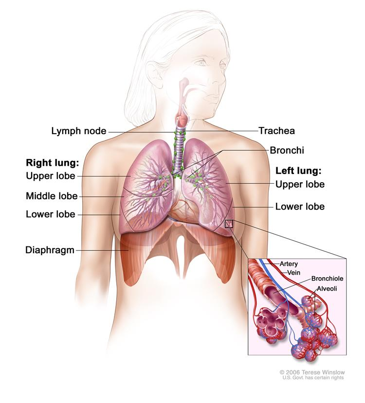

## 姚树坤副院长  
### His系统整合精准医疗  
### 药学指导  
### MDT模式  
Multidisciplinary care - when professionals from a range of disciplines work together to deliver comprehensive care that addresses as many of the patient's needs as possible. This can be delivered by a range of professionals functioning as a team under one organisational umbrella or by professionals from a range of organisations, including private practice, brought together as a unique team. As a patient's condition changes over time, the composition of the team may change to reflect the changing clinical and psychosocial needs of the patient.

### 远程平台（远程会诊）  
可复制、可指导

**《精准医学:药物治疗纲要 王辰,姚树坤 主编》**
### 一些现状  
**bioinfo特别缺乏，病理分子诊断需要注意**

#### 主要是：个体化用药，药物基因组学；  
其中最好的应用是肿瘤靶向药物，孕前、胎儿的高危疾病预防，新生儿筛查，高危家族筛查

### 哈佛疑难病研究中心 #pending  

## 王鹤尧  
### 指南治的弊端（个体差异需要重视）  
指南医疗(基础)->经验医疗（指南医疗的补充和提高）->精准医疗（前两者的补充）
### 精准医疗侧重点    
- 梅奥诊所：治疗药物与基因组
- 精准医学药物（毒性基因、根据基因调整剂量）
- 欧洲精准医疗路径：
- patient->pharmacist（检测基因，给出建议报告）->physician （给出方案）
- 分子病理诊断、基因水平个体差异、远程疫苗 etc.

#### 不考虑基因的治疗是不完善的个体化治疗  
- 基因（片面信息）
- 面对复杂的肿瘤发生机制和肿瘤的特异性，靶向治疗存在局限性。
- 10^9个肿瘤细胞才可见
## 罗杰  

### 肿瘤：多基因、多因素、多时段（一次、二次乃至多次）的改变（基因）  

#### 靶向药物分类  
##### A  
- 大分子单克隆抗体
- 小分子激酶抑制剂
##### B  
- 针对细胞膜、细胞质、细胞核、血管生成的靶向药物

**eGFR突变->肺腺癌的驱动基因**

非小细胞肺癌 
 

###  结直肠肿瘤特殊  
微卫星不稳定（结直肠癌）5氟尿嘧啶不受益（其他首选）

右半结肠癌症多位微卫星不稳定
