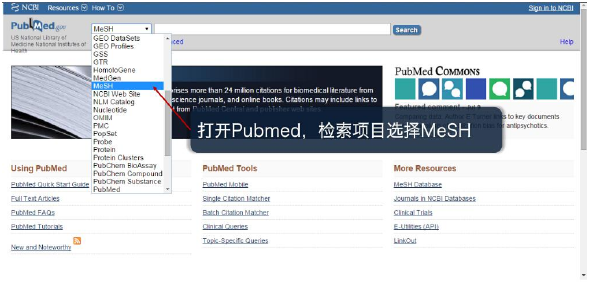
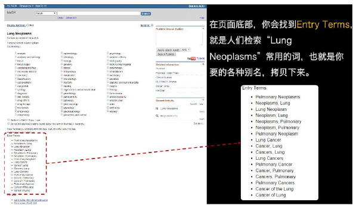

# Meta分析第一课

## Meta分析的四步骤

###  一、提出问题
- 有意义：有临床意义
- 有对比：不应该是开放式的
- 有争议：有争议的问题最适合做Meta分析
- 有创新
- 有文献:需要足够的文献

####应该注意的问题
- 临床中遇到过
- 导师指定过
- 学术会议上，听大牛提过
- 读文献是偶然看过

#### 简便选题的技巧
- 把题目打散
- 找到一个突破口
- 通过它，找到其他
- 在其他中选择

### 选题

1. 正确的、标准的选题方式：**由因及果**  
**先提出问题，然后查找数据**

2. 以“发表论文为目的”的选题： **由果及因**
**先找到数据，然后提取问题**

### 选题过程

1. 确定大方向：某药、某病、某种治疗方法、某个因素
2. 检索**近期发表的高质量研究**
3. 筛选出几个感兴趣的研究
4. 基于这几个研究，分别检索，查看是否有足够的文献报道
5. 找出几个选题方向，分别筛选
6. 确定选题

### 查找近期高质量研究
#### 方法1   : Google schoolar

- 限定检索时间**（新的）**

- 找到相关研究**通过被引用次数，判断研究的重要程度**

#### 方法2:Pubmed
- 进入Pubmed 首页上的Single Citation Matcher
- 查找目标期刊**发表的期刊越牛，文章越牛**
- 浏览目标期刊，找到相关研究（限定文献类型和发表时间）

### 筛选文献
- 近期发表
- 对比清晰
- 结果明确
- 有其他文献液胞到了相同问题
- 类似研究不要太多

### 文献检索
#### 拆题目

根据PICOS原则拆题目

| P | I |C|O|S|
|--------|--------|-|-|-|
|Patient|Intervention|Comparison|outcome|Study design|
|谁|怎么处置|和谁比|结果如何|怎么设计|

#### 检索主题词

PIC：主题词+自由词
S：special

主题词：Pubmed-->Mesh（medical subject heading）

自由词：

 
 

#### 必须检索的数据库

- Pubmed
- medline
- EMBASE
- Cochrane Library

#### 有精力应该检索的网站

- web of science
- clinicaltrials.gov

####
###  二、查找数据
###  数据提取
###  汇总分析
