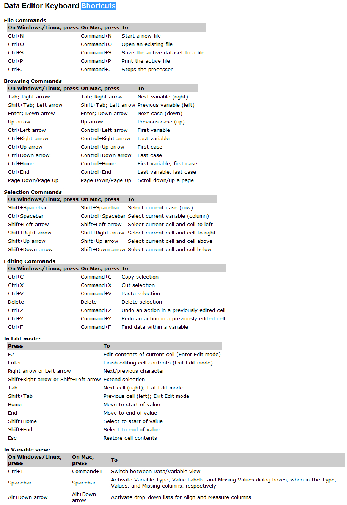

# SPSS软件基本数据管理功能

## 1、定义变量：

名称、类型、宽度、小数、标签（解释名称）、值（定义分类变量）、缺失；

## 2、排序：

数据--排序，可同时选择两个以上的变量排序，但有先后区分；

## 3、拆分文件：

分组分析，如按照性别对身高进行描述，先按性别进行拆分，再分析身高，结果就可以得到分性别对身高的分析结果；

## 4、语法窗口：

进行分析时不点确定，点击粘贴，即可进入语法窗口，语法窗口很有用，通过语法文件提高统计分析的效率。

## 快捷键

**Ctrl+t**:切换变量界面及数据界面

## 选择个案：
选择满足一定条件的个案进行统计分析，如仅对有高血压家族史的进行分析；

## 计算变量：
产生一个新的变量，如利用身高体重计算出一个新的变量BMI；

Transform -->  compute variates

## 重新编码为不同变量：
可以把数字变量转化为分类变量，如把BMI这个数值编码为几个分类，正常，超重和肥胖；
