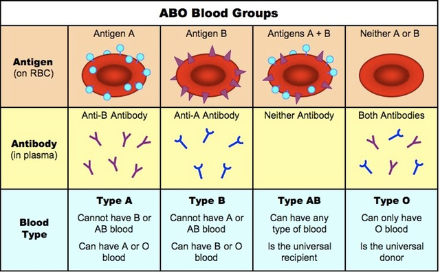
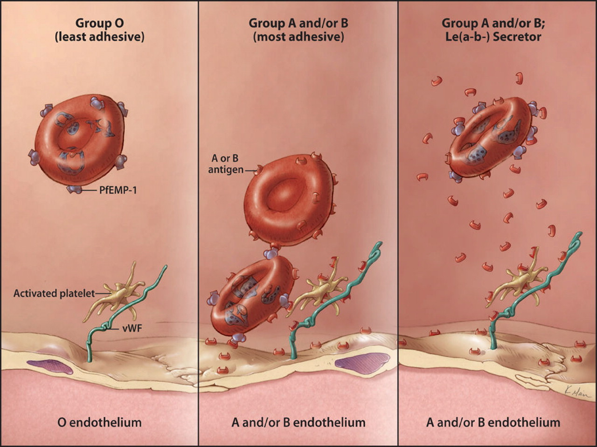

# 输血培训

## 临床常见血型

### ABO 血型
<center>




***



</center>

**ABO血型存在亚型**<br>
A1、A2、A3、Aend、AX 、Am、Ay、Ael、B(A)......

### Rh血型
一般指Rh系统中D抗原的检测,根据红细胞是否带有D抗原,分为Rh(D)阳性和Rh(D)阴性。

**同样存在变异型**
弱D、Del、部分D、D增强

### 血小板血型

- 红细胞血型抗原（ABO，无Rh）
- HLA系统抗原（HLA I，无HLA II）
- 血小板特异性抗原（HPA，费血小板特有）

### 白细胞抗原系统

----

## 临床输血

### 血制品种类

#### 红细胞类制品

<sub>**单位:U(1U由200ml全血制备,约150ml)**</sub>

- 悬浮红细胞：将全血中的大部分血浆在全封闭的条件下分离后
并向剩余物中加入红细胞添加液制成的红细胞成分
血。

- 少白红细胞

- 洗涤红细胞（2U约250ml）：洗涤红细胞：封闭环境生理盐水洗涤三次（血浆蛋白过敏患者，ABO亚型血型，未知血型急救）保存20多天？

- 辐照红细胞

- 冰冻红细胞：保护剂（甘油）

#### 血小板类制品

- 浓缩血小板:离心机
- 单采血小板（治疗量,1治疗量约250-300ml,2.5*10<sup>11</sup>）:体外循环采集


<sub>**10个治疗量的浓缩血小板=1个治疗单位的单采血小板**</sub>
- 辐照血小板

#### 血浆制品

- 新鲜冰冻血浆(蛋白≥50g/L,VIII0.7IU/ml)
- 普通冰冻血浆
- 单采血浆
- 病毒灭活血浆

**<sub>血友病或需补充血浆成分最好输入新鲜冰冻血浆</sub>**

### 血浆成分特殊处理

#### 去白细胞

- [非溶血性发热(febrile_non-haemolytic)](https://transfusion.com.au/adverse_transfusion_reactions/febrile_non-haemolytic)
- HLA同种面议
- 亲白细胞病毒感染
- 过滤

#### 辐照

- 灭活免疫活性淋巴细胞
- 免疫缺陷、抑制患者、新生儿换血、近亲输血
- [输血相关性移植物抗宿主病(TA-GVHD)](https://transfusion.com.au/adverse_transfusion_reactions/TA-GVHD)
- 25Gy-30Gy γ射线

#### 洗涤

- 洗除99%血浆,80%白细胞,保留70%红细胞
- 血浆过敏患者、自身免疫性溶血性贫血患者,高钾血症及肝肾功能障碍患者
- 生理盐水洗涤

## 红细胞输血目的及适应证

**书写病历时应当注意适应证的正确书写**

### 红细胞输血目的：

**补充红细胞，纠正贫血，改善组织供氧**

### 少白细胞红细胞适应证（反复、移植）

- 准备反复输血者
- 准备器官移植者
- 由于反复输血已产生白细胞、血小板抗体引起非溶血性发热者

### 冰冻红细胞适应证（稀有）

- 主要用于稀有血型患者输血

### 辐照红细胞适应证（免疫<sub>过弱</sub>）

- 免疫缺陷或免疫抑制患者输血、新生儿换血、宫内输血、近亲供血者血液输血

### 悬浮红细胞（急、慢、功能不全）

- 外伤或手术引起的急性失血需要输血者
- 心、肾、肝功能不全需要输血者
- 血容量正常的慢性贫血需要输血者
- 儿童的慢性贫血

### 洗涤红细胞(免疫<sub>过强</sub>)

- 输入全血或血浆后发生过敏反应的患者
- 自身免疫性溶血性贫血患者
- 高钾血症、肾功能障碍需要输血者

## 血小板、血浆输血目的

### 血小板输注
主要用于**预防和治疗**血小板数量或功能异常所致的出血,**恢复和维持** 机体的正常止血和凝血功能。

### 新鲜冰冻血浆
主要用于补充体内各种凝血因子的缺乏

### 血小板输血适应证

#### 预防性血小板输注

- 血小板计数低于5×10<sup>9</sup>/L ,无论有无明显出血都应及时输注血小板,**以免颅内出血**。

- 血小板计数低于20×10<sup>9</sup>/L伴有严重出血者应输注血小板。

-血小板低下患者须手术或侵入性检查,血小板计数≤ 50×10<sup>9</sup>/L者须预防性输注血小板。脑部或眼部手术须提高血小板计数>100×10<sup>9</sup>/L

#### 治疗性血小板输注

- 血小板生成减少引起的出血
- 大量输血
- 脾肿大
- 感染和弥散性血管内凝血
- 特发性血小板减少性紫癜
- 血小板功能异常所致严重出血

### **血小板输血禁忌症**

- [肝素诱导性血小板减少症](https://en.wikipedia.org/wiki/Heparin-induced_thrombocytopenia)
- 血栓性血小板减少性紫癜
- 溶血尿毒综合征


### 新鲜冰冻血浆输血适应证
- 单个凝血因子缺乏如血友病,无相应浓缩制剂时
- 肝病患者获得性凝血功能障碍
- 大量输血伴发的凝血功能紊乱
- 口服抗凝剂过量引起的出血
- 血栓性血小板减少性紫癜
- 免疫缺陷综合征
- 抗凝血酶III缺乏
- DIC

### 新鲜冰冻血浆输血禁忌证
- 血浆过敏
- 血容量正常的年老体弱患者、重症婴幼儿、严重贫血或心功能不全的患者,易发生循环超负荷应慎用血浆。
- **补充血容量、补充营养、增强免疫力、消除水肿**

----

## 输血不良反应

###发热性非溶血性输血反应

接受输血的患者在输血期间或输血后**1-2h内体温升高1°C或以上**,并**排除**其他可导致体温升高的原因。

表现:除发热外可伴有寒战、恶心、呕吐、出汗、皮肤潮红等症状,**一般血压不降低。**

预防:输注少白细胞红细胞、应用退热药。
发生率0.5%-1%


### 溶血性输血反应

#### 急性溶血性输血反应
大多数由于**ABO血型系统不相
容**输血引起,为**血管内溶血**,人为差错是主要原因。

多于输血后**数分钟至数小时**出现烦躁、恐惧不安、发热、畏寒、全身麻木、胸部压迫感、胸部或背部疼
痛、面色发红、呼吸困难、心动过速及血压下降、全身出血及**血红蛋白尿**、黄疸。

#### 迟发型溶血性输血反应

多由**ABO血型系统以外的血型系统抗体引起**,为**血管外溶血**。不明原因的发热、贫血、黄疸。


### 过敏性输血反应

临床表现为皮肤瘙痒、荨麻疹、红斑、血管神经性水肿,重者支气管痉挛、喉头水肿、呼吸困难、发绀、
过敏性休克。

**最常见的输血不良反应**


### 输血相关性移植物抗宿主病

输入含有供者免疫活性淋巴细胞的血液或血液成分后,不被受者免疫系统识别或排斥,供者淋巴细胞在受者体内植活,增殖并攻击破坏受者体内的组织器官及造血系统,是**致命性的免疫性输血并发症**


### 输血相关急性肺损伤

从开始输注血液制品到完毕后2-6小时内,由于输入含有与受血者HLA相应的抗HLA、人类粒细胞抗原HNA相应的抗HNA的全血或含有血浆的血液成分,
发生抗原抗体反应,导致突然发生的**急性呼吸功能不全或非心源性水肿**。

**献血源多为多次妊娠女性**

### 大量输血并发症

大量输血的死亡三联症:**酸中毒、低体温、凝血功能紊乱**

####大量输血的代谢变化

- 循环超负荷
- 血钾改变
- 高血氨
- 枸橼酸盐中毒
- 肺微循环栓塞

### 细菌性输血反应


### 含铁血黄素沉着症

长期反复输注全血、红细胞使体内铁负荷过重的一种输血不良反应

----

## 手术及创伤输血指南

### 浓缩红细胞

用于需要提高血液携氧能力,血容量基本正常或低血容量已被纠正的患者。低血容量患者
可配晶体液或胶体液应用。
1. 血红蛋白>100g/L,可以不输。
2. 向红蛋白<70g/L,应考虑输。
3. 血红蛋白在70~100g/L,根据患者的贫血程度、心肺代偿功能、有无代谢率增高以及年龄等因素决定。

### 血小板

用于患者血小板数量减少或功能异常伴有出血倾向或表现。

1. 血小板计数>100×10<sup>9</sup>/L,可以不输。
2. 血小板计数<50×10<sup>9</sup>/L,应考虑输。
3. 血小板计数在(50~100)×10<sup>9</sup>/L,应根据是否有自发性出血或伤口渗血决定。
4. 如术中出现不可控渗血,确定血小板功能低下,输血小板不受上述限制。

### 新鲜冰冻血浆（FFP）

用于凝血因子缺乏的患者。

1. PT或APTT>正常1.5倍,创面弥漫性渗血。
2. 患者急性大出血输入大量库存全血或浓缩红细胞后(出血量或输血量相当于患者自身血容量)。
3. 病史或临床过程表现有先天性或获得性凝血功能障碍。
4. 紧急对抗华法林的抗凝血作用(FFP:5~8ml/kg)。

----

## 内科输血指南

### 红细胞


用于红细胞破坏过多、丢失或生成障碍引起的慢性贫血并伴缺氧症状。血红蛋白<60g/L或血细胞比容<0.2时可考虑输注。


### 血小板

血小板计数和临床出血症状结合决定是否输注血小板,血小板输注指征:
血小板计数>50×10<sup>9</sup>/L一般不需输注。

血小板计数(10~50)×10<sup>9</sup>/L根据临床出血情况决定,可考虑输注。

血小板计数<5×10<sup>9</sup>/L应立即输血小板防止出血。

预防性输注不可滥用,防止产生同种免疫导致输注无效。有出血表现时应一次足量输注并
测CCI值。

CCI=(输注后血小板计数一输注前血小板计数)(10 <sup>11</sup> )×体表面积(秆)/输入血小板总数(10<sup>11</sup>)

**注:输注后血小板计数为输注后一小时测定值。CCI>10者为输注有效。**


### 新鲜冰冻血浆

用于各种原因(先天.陛、后天获得性、输人大量陈旧库存血等)引起的多种凝血因子II、V、VII、IX、X、XI或抗凝血酶III缺乏,并伴有出血表现时输注。一般需输入10~15ml/k体重
新鲜冰冻血浆。


### 新鲜液体血浆

主要用于补充多种凝血因子(特别是VIII因子)缺陷及严重肝病患者。


### 普通冰冻血浆

主要用于补充稳定的凝血因子。

-----

## 输血问题

### 流程

评估-->术前常规-->《输血治疗知情同意书》-->输血相容性检测-->医护取血核对、输注-->输血治疗记录及评价

### 输血科实验

- 输血相容性检测
- ABO血型正反定型
- RhD血型
- 不规则抗体筛选实验
- 交叉配血
- 血栓弹力图实验

### **输血顺序**

**先输入血小板，后输红细胞、血浆**

**血小板快速输注**,1治疗量血小板输注时间不超过20min

**红细胞宜慢不宜快**,成人1U不应小于1小时或按1-3ml/(kg·h),4h内输注完毕


```
板快1U20min；

红慢1U1小时
```
**堵塞时,及时更换输血器,不可强行挤压滤网及管道。**

> (  )年（  ）月（  ）日（时）:（分）   输血记录<br>
**输血原因:**(患者目前状态;存在贫血、失血、凝血功能障碍,纠正贫血增加
血液携氧能力、改善凝血功能)<br>
**输血指征:**(HB;HCT; 凝血功能等检验结果)<br>
**输血时间、输血量及输血成分:** ( )日(时) :(分) ( )型Rh ( )性(成分名称)(输注量)<br>
**输血过程中反应:**输血过程中患者(有/无)明显畏寒、高热、恶心,(有/无)
头痛、皮肤潮红、心悸,(有/无)皮疹、荨麻疹······。(顺利输完)<br>
**输注后效果评价:**(患者目前状态,***得到改善;检验结果)<br>
&emsp;&emsp;&emsp;&emsp;&emsp;&emsp;&emsp;&emsp;&emsp;&emsp;&emsp;&emsp;&emsp;&emsp;&emsp;&emsp;&emsp;&emsp;&emsp;&emsp;&emsp;&emsp;&emsp;&emsp;&emsp;&emsp;&emsp;&emsp;&emsp;&emsp;&emsp;&emsp;&emsp;&emsp;&emsp;**医师:**


### 申请

|申请备用血量(ml)|申请人职称|上级核准|科室主任核准|医务部门|
|-|-|-|-|-|
|<800|中级以上专业技术职务任职资格|√|
|800-1600|中级以上专业技术职务任职资格|√|√|
|>1600|中级以上专业技术职务任职资格|√|√|√|
